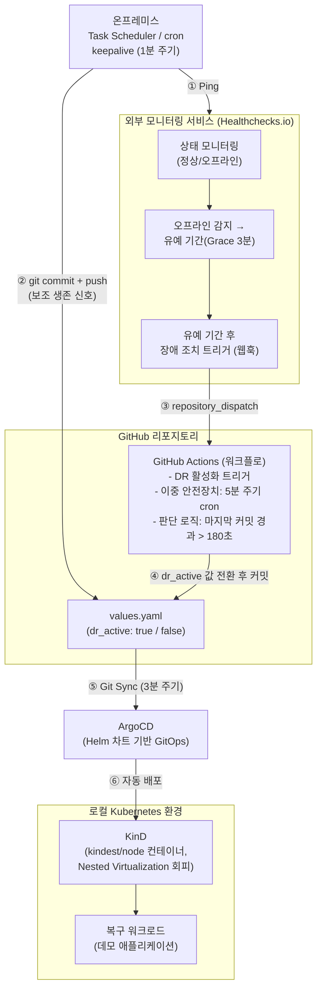

# subDR — DR(재해복구) 자동화 파이프라인

온프레미스 장애를 자동으로 감지하여 Kubernetes 클러스터에 복구 워크로드를 자동 배포하는 **DR(Disaster Recovery) 자동화 파이프라인** 구현입니다. 자동 복구가 실제로 동작함을 증명하기 위한 데모용 워크로드(실습 튜터 앱)를 함께 포함하고 있습니다.

---

## 1. 프로젝트 개요

이 저장소는 담당한 **DR 자동화 파이프라인** 구현 내용입니다.

- **장애 감지**: 온프레미스(또는 이를 대체하는 서버)가 주기적으로 가용성 신호(Healthchecks.io ping + git commit)를 전송하고, 신호가 끊기면 외부 모니터링 서비스가 이를 감지합니다.
- **자동 전환**: 장애 감지 시 GitHub Actions가 Helm 차트 값(`dr_active`)을 자동으로 변경·커밋합니다. 웹훅 기반 즉시 트리거와 5분 주기 cron 기반 백업 트리거를 이중으로 구성했습니다.
- **자동 배포**: ArgoCD가 저장소 변경을 감지(GitOps)하여, Kubernetes 클러스터에 복구 워크로드를 자동으로 배포/제거합니다.
- **인프라 제약 대응**: 퍼블릭 클라우드 환경에서 발생 가능한 가상화 중첩(Nested Virtualization) 제약을 고려해, VM 대신 컨테이너 기반 경량 클러스터 도구인 **KinD(Kubernetes in Docker)**를 채택했습니다.
- **데모 워크로드**: 자동 복구가 실제로 "동작하는 애플리케이션"을 배포한다는 것을 보여주기 위해, 실행 기반 채점(K8s/Terraform 실습)과 AI 튜터(RAG 보강)를 갖춘 데모용 웹 애플리케이션을 자체 제작해 복구 대상으로 사용했습니다.

---

## 2. 아키텍처 다이어그램



---

## 3. 사용 기술 스택 및 버전

### DR 자동화 · 인프라
| 구분 | 기술 | 버전/비고 |
|---|---|---|
| 컨테이너 | Docker | `python:3.12-slim` 베이스 이미지 |
| 로컬 K8s 클러스터 | KinD (Kubernetes in Docker) | - |
| GitOps 배포 | ArgoCD | Helm 차트 기반 배포 |
| Helm 차트 | Chart API v2 | `appVersion: 1.0` |
| CI/CD 자동화 | GitHub Actions | 5분 cron + `repository_dispatch` |
| 외부 모니터링 | Healthchecks.io | Period 1분 / Grace 3분 |
| 온프레미스 heartbeat | PowerShell(`keepalive.ps1`) / Bash(`keepalive.sh`) | Windows 작업 스케줄러 / Linux cron |

### 실행 기반 채점 엔진 (데모 워크로드 내부)
| 구분 | 기술 | 버전 |
|---|---|---|
| Kubernetes CLI | kubectl | dl.k8s.io stable 채널 |
| IaC | Terraform | 1.9.8 |

### AI 튜터 · RAG (데모 워크로드 내부)
| 구분 | 기술 | 버전 |
|---|---|---|
| 언어 | Python | 3.12 |
| AI 모델 | Upstage Solar API | solar-pro3 |
| HTTP 클라이언트 | httpx | 0.28.1 |
| PDF 텍스트 추출 (RAG) | PyMuPDF | 1.25.2 |
| RAG 검색(TF-IDF) | scikit-learn | 1.6.1 |
| 설정 파싱 | PyYAML | 6.0.2 |
| 환경변수 로딩 | python-dotenv | 1.0.1 |

---

## 4. 실행 및 배포 방법

### 4.1 로컬 개발 실행
```bash
cp .env.example .env
# .env 값 채우기는 5번 "환경 변수 설정 방법" 참고

pip install -r requirements.txt
python build_rag_index.py   # (선택) 강의자료 PDF가 있을 때만, RAG 인덱스 생성
uvicorn app:app --reload --port 8000
```
`http://localhost:8000` 접속.

### 4.2 컨테이너 이미지 빌드
```bash
docker build -t subdr-app:test .
```

### 4.3 로컬 Kubernetes(KinD) 클러스터 배포
```bash
kind create cluster --name dr-cluster
kind load docker-image subdr-app:test --name dr-cluster

kubectl apply -f templates/lab-sandbox-rbac.yaml   # 실행 기반 채점 샌드박스(RBAC) 사전 배포

# ArgoCD 설치 후, 이 저장소를 소스로 하는 Application 등록
kubectl apply -f <argocd-application.yaml>
```

### 4.4 DR 자동화(장애 감지 → 자동 배포) 활성/비활성
`values.yaml`의 `dr_active` 값으로 제어됩니다.
```yaml
dr_active: false   # 평소 상태 (복구 워크로드 미배포)
dr_active: true    # 장애 상태 (복구 워크로드 자동 배포)
```
이 값은 `.github/workflows/dr-trigger.yml`이 아래 조건에서 자동으로 전환합니다.
- Healthchecks.io 웹훅(`repository_dispatch`) 수신 시
- 또는 5분 주기 cron 실행 시, 마지막 커밋 경과 시간이 180초를 초과한 경우

### 4.5 온프레미스 heartbeat 등록
- **Windows**: `hc-ping-url.local.txt`에 Healthchecks Ping URL을 넣고
  ```powershell
  powershell -ExecutionPolicy Bypass -File .\register-keepalive-task.ps1
  ```
- **Linux/EC2**:
  ```bash
  chmod +x keepalive.sh
  (crontab -l 2>/dev/null; echo "* * * * * $(pwd)/keepalive.sh >> $(pwd)/keepalive.log 2>&1") | crontab -
  ```

---

## 5. 환경 변수 설정 방법

### 5.1 로컬 실행용 `.env`
`.env.example`을 복사해 `.env`로 저장한 뒤 값을 채웁니다. (`.env`는 `.gitignore` 처리되어 절대 커밋되지 않습니다)

```bash
cp .env.example .env
```

| 변수명 | 필수 여부 | 설명 |
|---|---|---|
| `UPSTAGE_API_KEY` | 선택 | [Upstage Console](https://console.upstage.ai)에서 발급받은 API 키. 비워두면 AI 튜터가 정적 힌트로 자동 폴백 |
| `UPSTAGE_MODEL` | 선택 | 기본값 `solar-pro3`. 필요 시 `solar-mini`, `solar-pro`, `solar-pro2` 등으로 변경 가능 |

### 5.2 클러스터 배포용 Secret
Kubernetes 클러스터에서는 `.env` 파일 대신 **K8s Secret**으로 주입합니다. 값은 터미널 히스토리에 남지 않도록 아래처럼 생성합니다.

```bash
kubectl create secret generic dr-tutor-ai-secret \
  --from-literal=UPSTAGE_API_KEY=<발급받은 키>
```
Secret이 없어도 애플리케이션은 정상 기동하며, AI 튜터 기능만 자동으로 비활성화됩니다.

### 5.3 온프레미스 heartbeat용 로컬 설정 파일
git에는 포함되지 않는 로컬 전용 설정 파일이 1개 필요합니다.

| 파일명 | 필수 여부 | 설명 |
|---|---|---|
| `hc-ping-url.local.txt` | 필수 (heartbeat 사용 시) | Healthchecks.io Check의 Ping URL 한 줄. `.gitignore` 처리되어 절대 커밋되지 않음 |

> 보안 주의: `UPSTAGE_API_KEY`, `hc-ping-url.local.txt`는 유출 시 오남용 가능한 값이므로, 코드에 하드코딩하거나 커밋하지 않습니다.
